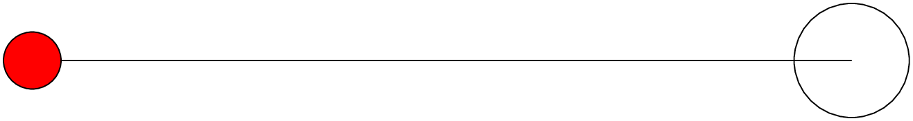
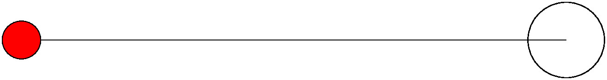
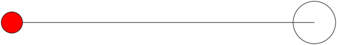
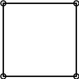
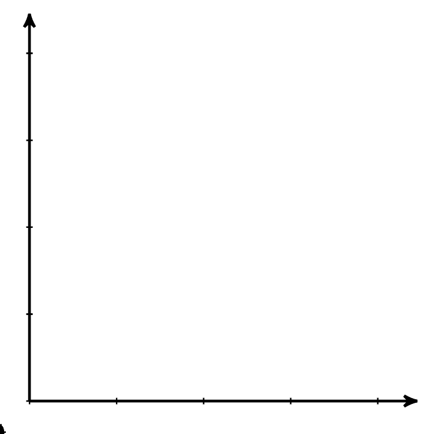

TikZ Examples
=============

Example 1
---------

This example shows:

  - How to generate files of various formats

According to `<https://jdhao.github.io/2019/11/20/convert_pdf_to_image_imagemagick/>`_

.. code-block::

  convert -density 150 presentation.pdf[0] -quality 90 -resize 50% test.jpg
  (not tested)

can convert page 0 of `presentation.pdf` to test.jpg.

.. code-block::

  convert -density 150 presentation.pdf -quality 90 output-%3d.jpg

can convert the whole pdf to separate images. Output will be named
``output-001.jpg``, ``output-002.jpg``, etc.

.. literalinclude:: ./code/tikz/hello/hello.tex
  :caption: code/tikz/hello/hello.tex
  :language: latex
  :linenos:

.. literalinclude:: ./code/tikz/hello/Makefile
  :caption: code/tikz/hello/Makefile
  :language: makefile
  :linenos:

    code/tikz/hello/hello.svg. Generated by::

      latexmk hello.tex
      dvisvgm --no-fonts hello.dvi hello.svg
      (this approach is preferred!)

    code/tikz/hello/hello_convert.svg. Generated by::

      latexmk -pdf hello.tex
      convert hello.pdf hello_convert.svg

    code/tikz/hello/hello.png. Generated by::

      latexmk -pdf hello.tex
      convert -density 300 hello.pdf -quality hello.png

    code/tikz/hello/hello.jpg. Generated by::

      latexmk -pdf hello.tex
      convert -density 300 hello.pdf -quality 90 hello.jpg

    code/tikz/hello/hello_50.jpg. Generated by::

      latexmk -pdf hello.tex
      convert -density 300 hello.pdf -quality 90 -resize 50% -background white -alpha remove hello_50.jpg

.. code-block::

  $ file hello*.jpg

  hello.jpg:    JPEG image data, JFIF standard 1.01, aspect ratio, density 300x300, segment length 16, baseline, precision 8, 1316x176, frames 3
  hello_50.jpg: JPEG image data, JFIF standard 1.01, aspect ratio, density 300x300, segment length 16, baseline, precision 8, 658x88, frames 3

Example 2
---------

This example shows:

  - How to generate multiple svg files from a single dvi file
  - How to convert multiple svg files to png files

.. literalinclude:: ./code/tikz/multi/multi.tex
  :caption: code/tikz/multi/multi.tex
  :language: latex
  :linenos:

.. literalinclude:: ./code/tikz/multi/Makefile
  :caption: code/tikz/multi/Makefile
  :language: makefile
  :linenos:

    code/tikz/multi/multi-1.svg. Generated by::

      latexmk multi.tex
      dvisvgm --no-fonts --page=1- multi.dvi
      (It generates multi-1.svg and multi-2.svg)

    code/tikz/multi/multi-2.svg

    code/tikz/multi/multi-1.png. Generated by::

      mogrify -density 300 -quality 98 -format png *.svg
      (It generates multi-1.png and multi-2.png)

    code/tikz/multi/multi-2.png

Example 3
---------
This is the first example from the tikz manual.
It shows:

  - How to use control points
  - How to use circle
  - How to use arc. Note how similar is the syntax with circle.
    We need a center for the circle and a starting point for the arc.
  - How to define styles inside tikzpicture environment
  - How to define styles outside tikzpicture environment

    Note that: ``\tikzstyle`` is deprecated, use ``\tikzset`` instead.

