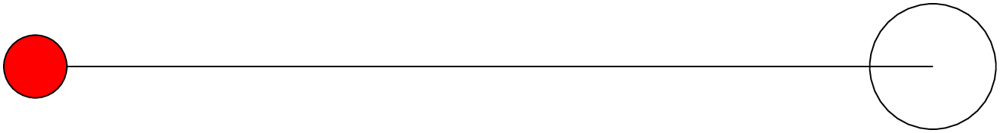
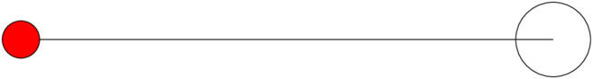

tikz
====

Install tools for pdf
---------------------

.. code-block::

    sudo apt-get install imagemagick

It installs ``convert``.

Edit::

    sudo vim /etc/ImageMagick-6/policy.xml

to solve the following error::

    $ convert -density 300 hello.pdf -quality 90 hello.png
    convert-im6.q16: not authorized `hello.pdf' @ error/constitute.c/ReadImage/412.
    convert-im6.q16: no images defined `hello.png' @ error/convert.c/ConvertImageCommand/3258.

replace::

    <policy domain="coder" rights="none" pattern="PDF" />

with::

    <policy domain="coder" rights="read|write" pattern="PDF" />

latexmk
--------

.. code-block::

    latexmk -C  # cleans every thing
    latexmk -c  # will not remove pdf, dvi

    latexmk hello.tex  # it generates hello.dvi
    dvips hello.dvi    # it generates hello.ps from hello.dvi
    ps2pdf hello.ps    # it generates hello.pdf from hello.ps

    latexmk -pdf hello.tex  # it generates hello.pdf

    # convert hello.pdf to hello.png
    # density specifies the dpi
    convert -density 300 hello.pdf -quality 90 hello.png

    convert -density 300 hello.pdf -quality 90 hello.jpg

    convert -density 300 hello.pdf -quality 90 -resize 50% -background white -alpha remove hello.jpg

    # convert hello.pdf to hello.svg
    convert hello.pdf hello.svg

xelatex
-------

.. code-block::

    xelatex hello.tex   # it generates hello.pdf

Example 1
---------

This example shows:

  - How to generate files of various formats

According to `<https://jdhao.github.io/2019/11/20/convert_pdf_to_image_imagemagick/>`_

.. code-block::

  convert -density 150 presentation.pdf[0] -quality 90 -resize 50% test.jpg
  (not tested)

can convert page 0 of `presentation.pdf` to test.jpg.

.. code-block::

  convert -density 150 presentation.pdf -quality 90 output-%3d.jpg

can convert the whole pdf to separate images. Output will be named
``output-001.jpg``, ``output-002.jpg``, etc.

.. literalinclude:: ./code/tikz/hello/hello.tex
  :caption: code/tikz/hello/hello.tex
  :language: latex
  :linenos:

.. literalinclude:: ./code/tikz/hello/Makefile
  :caption: code/tikz/hello/Makefile
  :language: makefile
  :linenos:

.. figure:: code/tikz/hello/hello.svg
    :alt: Result code/tikz/hello/hello.svg
    :align: center
    :figwidth: 600px

    code/tikz/hello/hello.svg. Generated by::

      latexmk hello.tex
      dvisvgm --no-fonts hello.dvi hello.svg
      (this approach is preferred!)

.. figure:: code/tikz/hello/hello_convert.svg
    :alt: Result code/tikz/hello/hello_convert.svg
    :align: center
    :figwidth: 600px

    code/tikz/hello/hello_convert.svg. Generated by::

      latexmk -pdf hello.tex
      convert hello.pdf hello_convert.svg

    code/tikz/hello/hello.png. Generated by::

      latexmk -pdf hello.tex
      convert -density 300 hello.pdf -quality hello.png

.. figure:: code/tikz/hello/hello.jpg
    :alt: Result code/tikz/hello/hello.jpg
    :align: center
    :figwidth: 600px

    code/tikz/hello/hello.jpg. Generated by::

      latexmk -pdf hello.tex
      convert -density 300 hello.pdf -quality 90 hello.jpg

    code/tikz/hello/hello_50.jpg. Generated by::

      latexmk -pdf hello.tex
      convert -density 300 hello.pdf -quality 90 -resize 50% -background white -alpha remove hello_50.jpg

.. code-block::

  $ file hello*.jpg

  hello.jpg:    JPEG image data, JFIF standard 1.01, aspect ratio, density 300x300, segment length 16, baseline, precision 8, 1316x176, frames 3
  hello_50.jpg: JPEG image data, JFIF standard 1.01, aspect ratio, density 300x300, segment length 16, baseline, precision 8, 658x88, frames 3
