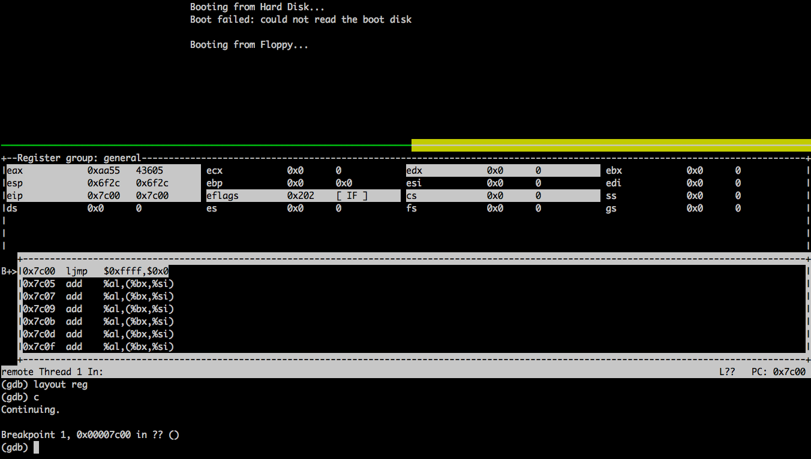

Day1
====

Upon reboot, PC is set to ``ffff:0000``. The computer tries
to find the boot sector and loads it to address 0x7c00 in memory.
A boot sector is of 512 bytes and ends with 0x55, 0xaa.

Note that x86 is little endian so we use ``.word 0xaa55``.

This notes shows:

1. how to generate a bootable image
2. how to print a string after booting
3. how to use qemu and gdb
4. load content from a floppy disk and jump to it
5. specify the link address for ``ld``
6. use the `.gdbinit` file for run gdb commands automatically
   when gdb is executed. ``gdb -q`` to disable the copyright message.

Floppy disk basics
------------------

Refer to Chapter 7.6.1 from `<https://github.com/tuhdo/os01>`_.

- Capacity of a floppy disk: 1.44 MB
- To read a floppy disk, the minimum bytes to read is 512 bytes (0.5 KB), i.e., a sector
- a track contains 18 sectors, e.g., 9 KB
- each side of the floppy disk has 80 tracks, e.g., 720 KB
- a floppy disk has two sides, e.g., 1440 KB
- a floppy has two heads, one for each side
- head 0 read/write the upper side
- head 1 read/write the lower side

- it write upper track 0 (head 0), then lower track 0 (head 1),
- then upper track 1, then lower tranck 1,
- then upper track 2, then lower tranck 2, ...

Exercise 1
----------

.. code-block::

.. literalinclude:: ./code/day1/ex1/boot.s
  :caption: boot.s
  :language: asm
  :linenos:

.. literalinclude:: ./code/day1/ex1/Makefile
  :caption: Makefile
  :language: makefile
  :linenos:

.. code-block::

	qemu-system-i386 -display curses -machine q35 -fda disk.img -gdb tcp::26000 -S

``qemu-system-i386 -machine help`` can display a list of supported machines.

- ``-fda disk.img`` means to use ``disk.img`` as a floppy disk
- ``-gdb tcp::26000`` means we can use gdb to connect to qemu
- ``-S`` let qemu wait for gdb to connect before starting to run

After starting qemu, open a new terminal:

.. code-block::

  $ gdb
  (gdb) set architecture i8086
  (gdb) target remote localhost:26000
  (gdb) b *0x7c00
  (gdb) layout asm
  (gdb) layout reg
  (gdb) c
  (gdb) c
  (gdb) kill

    Output of exercise 1

.. HINT::

  While entering ``set architecture i8086``, we can use ``tab`` for auto completion.

Exercise 2
----------

Print a string after booting.

.. literalinclude:: ./code/day1/ex2/boot.s
  :caption: boot.s
  :language: asm
  :linenos:

Exercise 3
----------

Specify the link address so that we can define variables.

.. literalinclude:: ./code/day1/ex3/boot.s
  :caption: boot.s
  :language: asm
  :linenos:

.. literalinclude:: ./code/day1/ex3/Makefile
  :caption: Makefile
  :language: makefile
  :linenos:

.. NOTE::

  We use ``ld -o boot.bin --oformat binary -Ttext 0x7c00 boot.o`` for generating ``boot.bin``.

Exercise 4
----------

Read sector 2 of the floppy disk and then jump to it.

Available memory for real mode:

.. code-block::

     - 0x00000000 - 0x000003FF - Real Mode Interrupt Vector Table
     - 0x00000400 - 0x000004FF - BIOS Data Area
     - 0x00000500 - 0x00007BFF - Unused
     - 0x00007C00 - 0x00007DFF - Our Bootloader
     - 0x00007E00 - 0x0009FFFF - Unused
     - 0x000A0000 - 0x000BFFFF - Video RAM (VRAM) Memory
     - 0x000B0000 - 0x000B7777 - Monochrome Video Memory
     - 0x000B8000 - 0x000BFFFF - Color Video Memory
     - 0x000C0000 - 0x000C7FFF - Video ROM BIOS
     - 0x000C8000 - 0x000EFFFF - BIOS Shadow Area
     - 0x000F0000 - 0x000FFFFF - System BIOS

We load sector 2 to ``0x500``.

.. literalinclude:: ./code/day1/ex4/boot.s
  :caption: boot.s
  :language: asm
  :linenos:

.. literalinclude:: ./code/day1/ex4/Makefile
  :caption: Makefile
  :language: makefile
  :linenos:

BIOS interrupt
--------------

`<http://www.ablmcc.edu.hk/~scy/CIT/8086_bios_and_dos_interrupts.htm#int10h_0Eh>`_

- video: ``0x10``
- disk: ``0x13``

References
----------

- Writing an x86 “Hello world” boot loader with assembly

    `<https://medium.com/@g33konaut/writing-an-x86-hello-world-boot-loader-with-assembly-3e4c5bdd96cf>`_

- https://github.com/chyyuu/os_kernel_lab/tree/lab1_X

    Tsinghua university's OS lab, based on xv6&jos (MIT), OS 161 (Harvard)
