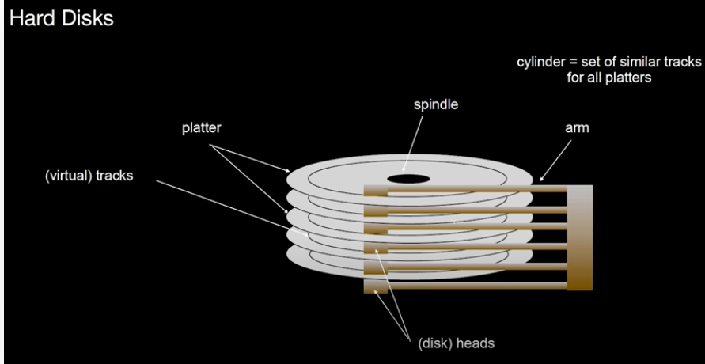

Hard Disks
==========

- spindle
- arm, head
- disk == platter.
- track
- cylinder
- sector: unit for read/write
- example: hard disk sector is 4KB, while OS block is 8KB
- CHS: cynliner, head, sector
- LBA: logical block addressing

    Refer to `<https://www.youtube.com/watch?v=Cj8-WNjaGuM>`_ at 2:23

    There is a course and a book: `<https://bigdata.uni-saarland.de/datenbankenlernen/>`_
