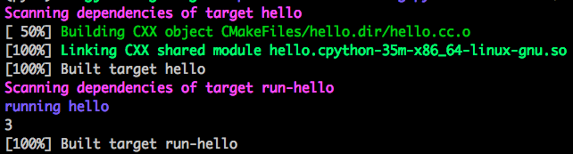

Build with CMake
================

Install CMake
-------------

1. Go to `<https://github.com/Kitware/CMake/releases>`_
2. Download ``cmake-3.17.0-Linux-x86_64.sh`` or any version
   above 3.0
3. ``chmod +x cmake-3.17.0-Linux-x86_64.sh``
4. ``./cmake-3.17.0-Linux-x86_64.sh --prefix=/path/to/install``
5. Modify ``PATH``

Build Example
-------------

To compile the following code

.. literalinclude:: ./code/hello.cc
  :caption: hello.cc
  :language: cpp
  :linenos:

Use the folliwng ``CMakeLists.txt``

.. literalinclude:: ./code/CMakeLists.txt
  :caption: CMakeLists.txt
  :language: cmake
  :linenos:

.. code-block:: bash

  mkdir build
  cd build
  cmake ..

should print something like the following

.. code-block:: console

    -- The C compiler identification is GNU 5.4.0
    -- The CXX compiler identification is GNU 5.4.0
    -- Check for working C compiler: /usr/bin/cc
    -- Check for working C compiler: /usr/bin/cc -- works
    -- Detecting C compiler ABI info
    -- Detecting C compiler ABI info - done
    -- Detecting C compile features
    -- Detecting C compile features - done
    -- Check for working CXX compiler: /usr/bin/c++
    -- Check for working CXX compiler: /usr/bin/c++ -- works
    -- Detecting CXX compiler ABI info
    -- Detecting CXX compiler ABI info - done
    -- Detecting CXX compile features
    -- Detecting CXX compile features - done
    -- Found PythonInterp: /path/to/py35/bin/python3.5 (found version "3.5.2")
    -- Found PythonLibs: /usr/lib/x86_64-linux-gnu/libpython3.5m.so
    -- Performing Test HAS_CPP14_FLAG
    -- Performing Test HAS_CPP14_FLAG - Success
    -- Performing Test HAS_FLTO
    -- Performing Test HAS_FLTO - Success
    -- LTO enabled
    -- Configuring done
    -- Generating done
    -- Build files have been written to: /path/to/pybind/code/build

.. code-block:: bash

  make run-hello

prints

.. code-block:: console

    Scanning dependencies of target hello
    [ 50%] Building CXX object CMakeFiles/hello.dir/hello.cc.o
    [100%] Linking CXX shared module hello.cpython-35m-x86_64-linux-gnu.so
    [100%] Built target hello
    Scanning dependencies of target run-hello
    running hello
    3
    [100%] Built target run-hello

    Output from ``make run-hello``
