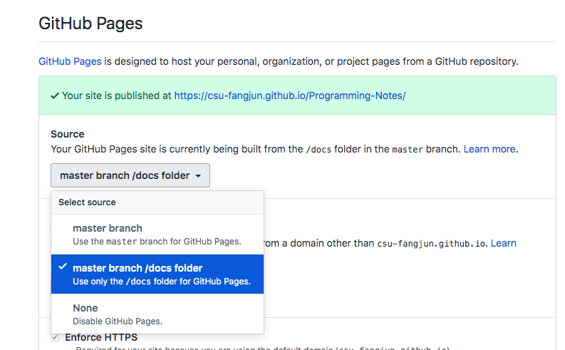

.. _sphinx_install:

Environment Setup
=================

First, create a virtual environment.

.. code-block:: sh

    virtualenv --no-site-packages --python=python3 /path/to/py3
    source /path/to/py3/bin/activate

Second, install ``sphinx`` via pip.

.. code-block:: sh

    pip install sphinx
    pip install sphinx_rtd_theme
    pip install sphinxcontrib-bibtex

To check that ``sphinx`` is installed successfully, run

.. code-block:: sh

    sphinx-build --version

It should print something like the following:

.. code-block:: sh

    sphinx-build 2.4.4

Third, run

.. code-block:: sh

    sphinx-quickstart

- Separate source and build directories (y/n) [n]: n
- Project name: Notes
- Author name(s): fangjun
- Project release: v0.1
- Project language [en]: en

Edit ``conf.py``

- ``import sphinx_rtd_theme``

- For the ``extensions`` list, add

.. code-block:: python

    extensions = [
        'sphinx.ext.autodoc',
        'sphinx.ext.autosummary',
        'sphinx.ext.githubpages',
        'sphinx.ext.mathjax',
        'sphinx.ext.napoleon',
        'sphinx.ext.todo',
        'sphinx.ext.viewcode',
        'sphinxcontrib.bibtex',
    ]

- Change ``html_theme`` to ``sphinx_rtd_theme``

- Add the following options:

.. code-block:: sh

    master_doc = 'index'
    pygments_style = 'sphinx'
    html_theme_path = [sphinx_rtd_theme.get_html_theme_path()]
    smartquotes = False
    html_show_sourcelink = True

Fourth, create a symlink:

.. code-block:: sh

    ln -s $PWD/docs _build/html

Fifth, generate ``html`` pages by running

.. code-block:: sh

    make html

The generated pages are inside the ``docs`` directory.

Sixth, create a repo on Github and push this project
to the created repo.

Finally, go to the settings tab of the repository
and select ``master branch /docs folder`` to publish
it as GitHub pages. The following is a screenshot.

    Setup Github Pages
