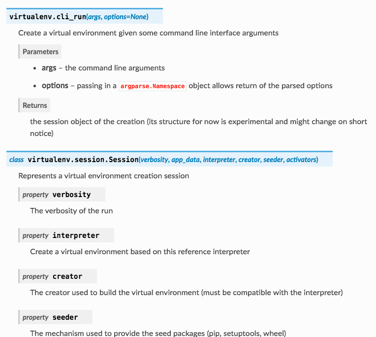

Open Sources
============

``conf.py`` of various open source projects that use ``sphinx``
for documentation generation.

`virtualenv`_
-------------

``conf.py`` is at `<https://github.com/pypa/virtualenv/blob/master/docs/conf.py>`_.

The source code is in `<https://github.com/pypa/virtualenv/tree/master/src/virtualenv>`_.

.. code-block:: console

  .. automodule:: virtualenv
     :members:

  .. currentmodule:: virtualenv.session

  .. autoclass:: Session
      :members:

produces

    Output from ``autodoc``

The directives for autodoc can be found at
`<https://www.sphinx-doc.org/en/master/usage/extensions/autodoc.html>`_.

.. _virtualenv: https://github.com/pypa/virtualenv/blob/master/docs/conf.py

